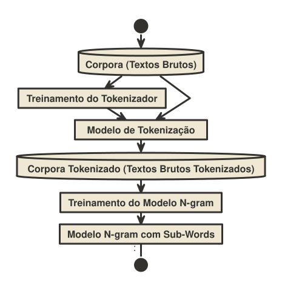

Colocar pontuações (Ex: ? , ! .) para textos brutos, usando de n-grams para rapidez e SentencePiece para lidar com palavras desconhecidas.
# Metodología

Restaurador de pontuações baseado em modelos N-grams utilizando a técnica de tokenização em sub-palavras (sub-words ) para lidar com palavras que nunca foram vista no treinamento do modelo N-grams (Out-of-Vocabulary - OOV). 

São usados as seguintes ferramentas:

- KenLM: Modelagem e Uso de Modelos N-grams.
- SentencePiece: Tokenização de palavras para sub-palavras (sub-words).

PipeLine do Treinamento:

Para escolher melhor pontuação, é usando o **Algoritmo Ganancioso** **(Greedy Algorithm)** com contexto de (palavra_anterior + palavras_atual + pontuação + palavra_posterior) para lidar com limitação do **Algoritmo Ganancioso** **(Greedy Algorithm)**.

# MVP

- O Restaurador será ser capaz de atualizar 

## Requisitos 

**Requisitos Funcionais:** 

- **Entrada:** Texto Bruto (sem pontuações).
- **Saída:** Texto com pontuações.
- **Suporte as seguintes pontuações:**
	- Virgula (**,**);
	- Ponto Final (**.**);
	- Ponto de Interrogação (**?**);
	- Ponto de Exclamação (**!**);

**Requisitos Não Funcionais:**

- **Interface Gráfica:** Restaurador ter uma interface gráfica para fácil uso.

# Corpus usando para treinamento dos modelos N-grams e SentencePiece.

- Aya Collection (Portuguese Split) - Português Formal;
- Tatoeba (Portuguese Split) - Português Formal;
- OpenSubtitles (Português Split) - Português Informal;
- BlogSet-BR - Português da Internet (internetês);
